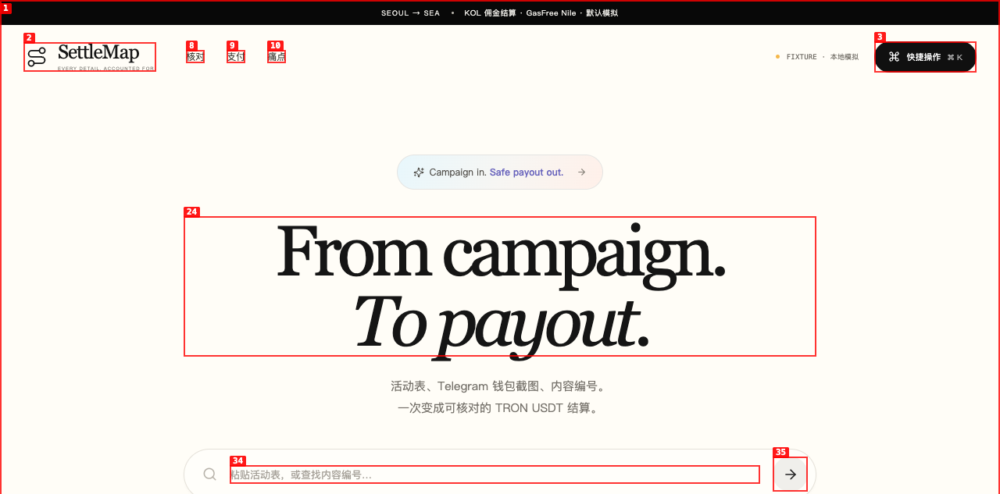

# SettleMap

> **GWDC 2026 Korea · TRON Challenge C**  
> GasFree stablecoin batch-payment validation, recovery and reconciliation assistant.

SettleMap helps a Seoul Web3 marketing operator reconcile monthly commissions for Southeast Asian creators. It imports a spreadsheet or local OCR draft, catches duplicate content, invalid or changed TRON addresses and unusual amounts, groups safe rows, preserves provider traces across lost browser responses, and exports row-level reconciliation evidence.

**中文简介：** SettleMap 把活动账表、Telegram 钱包截图和内容编号整理成可核对、可恢复、可交接的 TRON USDT 结算批次。它拦截错地址、重复内容、历史已付和地址变化，并把每笔结果回填到原始业务行。



## Submission materials · 提交材料

- [Public GitHub repository](https://github.com/Jimmycoding0301/gwdc-2026-settlemap)
- [56-second demo video](https://github.com/Jimmycoding0301/gwdc-2026-settlemap/raw/refs/heads/main/docs/submission/demo.mp4)
- [Pitch deck](https://github.com/Jimmycoding0301/gwdc-2026-settlemap/raw/refs/heads/main/docs/submission/pitch-deck.pptx)

## Three-minute demo · 三分钟演示

1. Load the complete synthetic September scenario and its confirmed August history.
2. Inspect 12 rows: OCR checksum error, duplicate content, a prior paid item, a changed wallet and an unusually large amount are surfaced before payment.
3. Correct or defer exceptions, record an address-change review and create a three-payment manifest for nine payable rows.
4. Run the fixture queue. The second response is intentionally lost after a provider trace is saved.
5. Resume the same trace without creating a duplicate payment.
6. Export business CSV, payment CSV, manifest and the reconciliation ZIP.

## Challenge fit · 赛题对应

- CSV/TSV paste and macOS local screenshot OCR.
- Address checksum, duplicate, historical-payment, amount and address-change review.
- GasFree Nile preflight for payer account, supported token, balance, frozen amount, nonce and dynamic fee.
- TronLink TIP-712 signing only after explicit confirmation.
- Provider request/trace recovery plus independent Nile transaction, receipt and exact TRC-20 `Transfer` verification.
- Row-level status, receipt copy and reconciliation exports.

## Current evidence status · 当前证据状态

The fixture and injected live-adapter tests are complete. In addition, one standalone, one-recipient GasFree Nile canary is now publicly verified: Provider `SUCCEED`, chain `SOLIDITY`, exact transfer verified at block `71389721`, log index `2`. Review the [sanitized evidence JSON](docs/evidence/gasfree-nile-canary.json), the [evidence index](docs/evidence/README.md), or the [Nile TRONSCAN transaction](https://nile.tronscan.org/#/transaction/1f3a3de905eeef90570bf297bb592d4ac16383a5a10c1187c4e09b41b5fdd586).

这份真实证据只覆盖一笔独立的单收款人 canary，不是标准演示中的三笔 fixture 批次，也不证明整批已在链上执行。现有截图和标准演示仍明确标记为 fixture；其中的 `sim_` request ID、trace 或 hash 不作为真实交易展示。

Recording cues: [docs/demo-script.md](docs/demo-script.md).

## Run locally · 本地运行

```bash
npm ci
npm run dev
```

- Web: <http://127.0.0.1:5174>
- API: <http://127.0.0.1:8788>

The full fixture demo works without credentials. Screenshot OCR requires macOS, Apple Vision and `/usr/bin/swift`.

The official GasFree SDK currently declares an older exact Node/pnpm engine, so npm 10 on Node 22 prints an `EBADENGINE` warning. The clean package nevertheless installs, passes all tests and builds successfully; the warning is retained rather than hidden.

```bash
npm test
npm run build
```

To reproduce the canary or run additional Nile validation, copy `.env.example` to `.env`, add credentials obtained directly from the official GasFree developer channel, and leave `ENABLE_GASFREE_LIVE=false` until the dedicated test wallet, derived GasFree account and test USDT are ready. Credentials, signer material, signatures and recovery journals remain local and are excluded from the public evidence.

## Safety model · 安全模型

- The backend never requests a wallet private key or seed phrase.
- Live submission requires credentials, the explicit kill switch, a Nile network check and a fresh TronLink signature.
- `UNKNOWN` blocks re-payment and resumes the original trace.
- GasFree maps `traceId` to `txHash`; independent Nile Solidity RPC verifies finality, execution and the exact token/from/to/amount log.
- Local `manifestHash` and `operationHash` aid reconciliation but are not on-chain and are not part of the wallet's TIP-712 signature.

See [SUBMISSION.md](SUBMISSION.md), [HACKATHON_SCOPE.md](HACKATHON_SCOPE.md), [SECURITY.md](SECURITY.md), [server boundaries](server/README.md), [verification notes](docs/verification.md), and the [public evidence index](docs/evidence/README.md).
